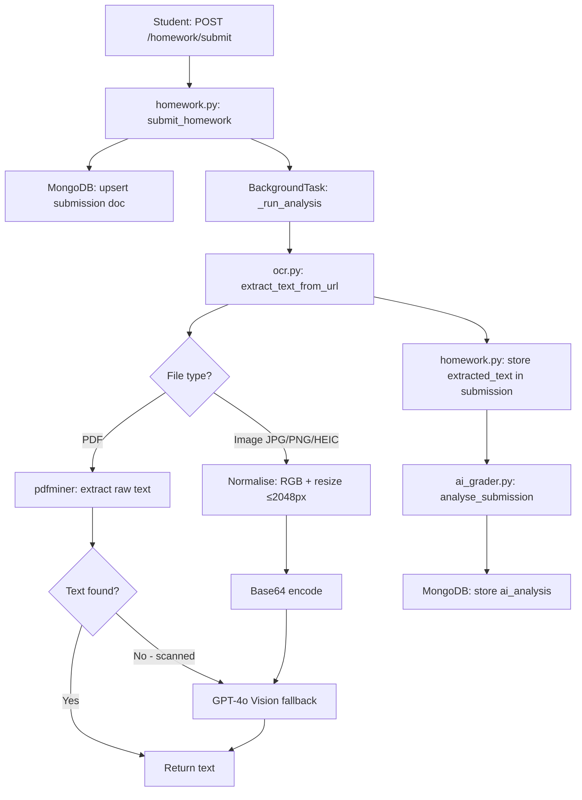
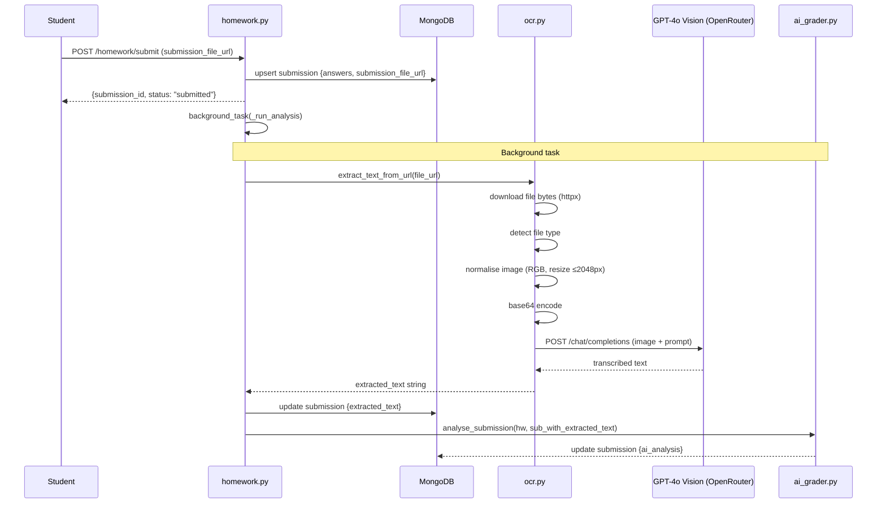
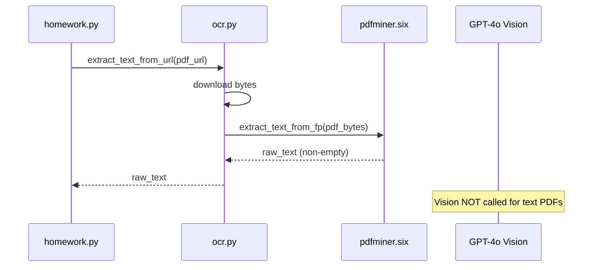
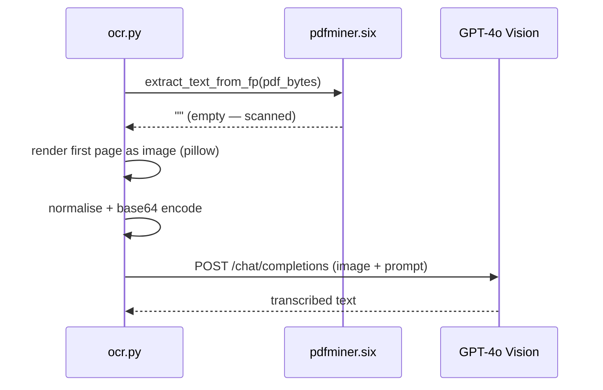

# Design Document: Vision OCR Integration

## Overview

Students on the platform can submit homework as image files (JPG, PNG, HEIC) or PDFs. Currently the AI grader receives `[file uploaded]` as the student answer, making its feedback meaningless. This feature introduces `backend/services/ocr.py` — a pipeline that normalises uploaded files, extracts text via pdfminer (PDFs) or GPT-4o Vision (images/scanned PDFs), and stores the result as `extracted_text` in the submission so the AI grader can produce real feedback.

The change is purely backend. No frontend modifications are required. The upload-file endpoint is unchanged; OCR runs as part of the existing `_run_analysis` background task triggered on submission.

---

## Architecture



---

## Sequence Diagrams

### Happy Path — Image Submission



### PDF Path — Text PDF



### PDF Path — Scanned PDF Fallback



---

## Components and Interfaces

### ocr.py — OCR Service

**Purpose**: Single entry point for all file-to-text extraction. Handles format detection, image normalisation, PDF text extraction, and Vision LLM calls.

**Interface**:
```python
async def extract_text_from_url(file_url: str) -> str:
    """
    Download file from S3 URL, detect type, extract text.
    Returns extracted text string, or "" on failure.
    Never raises — errors are caught and logged.
    """

def _normalise_image(img_bytes: bytes, filename: str) -> bytes:
    """
    Convert image to RGB, resize longest side to ≤ MAX_PX (2048).
    Returns JPEG bytes.
    Supports: JPEG, PNG, HEIC (via pillow-heif).
    """

async def _vision_extract(image_bytes: bytes) -> str:
    """
    Send base64-encoded image to GPT-4o via OpenRouter.
    Returns transcribed text.
    """

def _pdf_extract_text(pdf_bytes: bytes) -> str:
    """
    Use pdfminer.six to extract text from PDF bytes.
    Returns stripped text, or "" if none found.
    """
```

**Responsibilities**:
- Download file bytes from S3 URL using httpx
- Detect file type from URL extension (`.pdf`, `.jpg`, `.jpeg`, `.png`, `.heic`)
- Normalise images to RGB JPEG at ≤ 2048px longest side
- Extract PDF text with pdfminer; fall back to Vision on empty result
- Call GPT-4o via the existing `llm.py` `chat_completion` function with a vision-compatible message payload
- Return plain text; never propagate exceptions to callers

### homework.py — Updated `_run_analysis`

**Purpose**: Orchestrate OCR before AI grading for file-based submissions.

**Updated logic**:
```python
async def _run_analysis(db, sub, hw):
    # 1. Run OCR if submission has a file URL
    file_url = sub.get("submission_file_url")
    if file_url:
        extracted_text = await extract_text_from_url(file_url)
        if extracted_text:
            await db.homework_submissions.update_one(
                {"_id": sub["_id"]},
                {"$set": {"extracted_text": extracted_text}}
            )
            # Inject into sub so ai_grader sees it immediately
            sub["extracted_text"] = extracted_text

    # 2. Run AI grading (unchanged)
    analysis = await analyse_submission(hw or {}, sub)
    await db.homework_submissions.update_one(
        {"_id": sub["_id"]},
        {"$set": {"ai_analysis": analysis, "ai_analysed_at": datetime.utcnow().isoformat()}},
    )
```

### ai_grader.py — Updated answer resolution

**Purpose**: Use `extracted_text` from the submission when available, instead of `[file uploaded]`.

**Updated answer resolution**:
```python
# In the qa_pairs loop:
student_answer = (
    ans.get("answer")
    or sub.get("extracted_text")   # <-- new: use OCR result for file submissions
    or ans.get("file_url", "[file uploaded]")
)
```

---

## Data Models

### Submission document — new field

```python
{
    # ... existing fields ...
    "submission_file_url": "https://bucket.s3.region.amazonaws.com/submissions/...",
    "extracted_text": str | None,   # NEW: populated by OCR service post-submission
    "ai_analysis": dict | None,
    "ai_analysed_at": str | None,
}
```

`extracted_text` is `None` until OCR completes. The AI grader checks for it before falling back to `[file uploaded]`.

---

## Key Functions with Formal Specifications

### `extract_text_from_url(file_url)`

```python
async def extract_text_from_url(file_url: str) -> str
```

**Preconditions**:
- `file_url` is a non-empty string (S3 public URL or presigned URL)
- File at URL is one of: `.pdf`, `.jpg`, `.jpeg`, `.png`, `.heic`
- Network access to S3 is available

**Postconditions**:
- Returns a string (may be empty on failure or unreadable file)
- Never raises an exception to the caller
- For text PDFs: returned string contains pdfminer-extracted content
- For images/scanned PDFs: returned string contains Vision LLM transcription
- Side effects: none (read-only operation)

**Error handling**:
- Network errors → log + return `""`
- Unsupported file type → log + return `""`
- Vision API errors → log + return `""`

---

### `_normalise_image(img_bytes, filename)`

```python
def _normalise_image(img_bytes: bytes, filename: str) -> bytes
```

**Preconditions**:
- `img_bytes` is non-empty bytes of a valid image
- `filename` extension is one of `.jpg`, `.jpeg`, `.png`, `.heic`

**Postconditions**:
- Returns JPEG bytes in RGB colour space
- Longest side of output image ≤ 2048px
- Aspect ratio is preserved
- If input is already ≤ 2048px on longest side, no resize occurs (only colour conversion)

**Loop invariants**: N/A (no loops; uses Pillow's `thumbnail()`)

---

### `_pdf_extract_text(pdf_bytes)`

```python
def _pdf_extract_text(pdf_bytes: bytes) -> str
```

**Preconditions**:
- `pdf_bytes` is valid PDF binary content

**Postconditions**:
- Returns stripped string
- Returns `""` if PDF contains no extractable text (scanned/image-only)
- No side effects

---

## Algorithmic Pseudocode

### Main OCR Dispatch Algorithm

```pascal
ALGORITHM extract_text_from_url(file_url)
INPUT:  file_url: string (S3 URL)
OUTPUT: text: string

BEGIN
  TRY
    file_bytes ← httpx.get(file_url).content
    ext        ← lowercase(file_url.split(".")[-1])

    IF ext = "pdf" THEN
      text ← _pdf_extract_text(file_bytes)
      IF text = "" THEN
        // Scanned PDF fallback: render page 1 as image
        page_image ← render_pdf_page_as_image(file_bytes, page=0)
        norm_bytes ← _normalise_image(page_image, "page.jpg")
        text       ← AWAIT _vision_extract(norm_bytes)
      END IF

    ELSE IF ext IN {"jpg", "jpeg", "png", "heic"} THEN
      norm_bytes ← _normalise_image(file_bytes, file_url)
      text       ← AWAIT _vision_extract(norm_bytes)

    ELSE
      LOG "Unsupported file type: " + ext
      text ← ""
    END IF

  CATCH any_exception AS e
    LOG "OCR failed for " + file_url + ": " + str(e)
    text ← ""
  END TRY

  RETURN text
END
```

### Image Normalisation Algorithm

```pascal
ALGORITHM _normalise_image(img_bytes, filename)
INPUT:  img_bytes: bytes, filename: string
OUTPUT: jpeg_bytes: bytes

CONST MAX_PX ← 2048

BEGIN
  IF lowercase(extension(filename)) = "heic" THEN
    register_heif_opener()   // pillow-heif hook
  END IF

  img ← PIL.Image.open(BytesIO(img_bytes))

  IF img.mode ≠ "RGB" THEN
    img ← img.convert("RGB")
  END IF

  longest_side ← max(img.width, img.height)
  IF longest_side > MAX_PX THEN
    img.thumbnail((MAX_PX, MAX_PX), PIL.Image.LANCZOS)
  END IF

  buf ← BytesIO()
  img.save(buf, format="JPEG", quality=85)
  RETURN buf.getvalue()
END
```

### Vision LLM Call Algorithm

```pascal
ALGORITHM _vision_extract(image_bytes)
INPUT:  image_bytes: bytes (normalised JPEG)
OUTPUT: text: string

CONST VISION_MODEL  ← "openai/gpt-4o"
CONST VISION_PROMPT ← "Transcribe all handwritten and typed text from this homework submission. Maintain formatting."

BEGIN
  b64 ← base64.b64encode(image_bytes).decode("utf-8")

  messages ← [
    {
      "role": "user",
      "content": [
        {"type": "text",       "text": VISION_PROMPT},
        {"type": "image_url",  "image_url": {"url": "data:image/jpeg;base64," + b64}}
      ]
    }
  ]

  text ← AWAIT chat_completion(messages, model=VISION_MODEL)
  RETURN text.strip()
END
```

---

## Example Usage

```python
# In _run_analysis (homework.py) — after this change:
from services.ocr import extract_text_from_url

async def _run_analysis(db, sub, hw):
    file_url = sub.get("submission_file_url")
    if file_url:
        extracted_text = await extract_text_from_url(file_url)
        if extracted_text:
            await db.homework_submissions.update_one(
                {"_id": sub["_id"]},
                {"$set": {"extracted_text": extracted_text}}
            )
            sub["extracted_text"] = extracted_text

    analysis = await analyse_submission(hw or {}, sub)
    await db.homework_submissions.update_one(
        {"_id": sub["_id"]},
        {"$set": {"ai_analysis": analysis, "ai_analysed_at": datetime.utcnow().isoformat()}},
    )

# In ai_grader.py — updated student_answer resolution:
student_answer = (
    ans.get("answer")
    or sub.get("extracted_text")
    or ans.get("file_url", "[file uploaded]")
)
```

---

## Error Handling

### Network failure downloading file from S3

**Condition**: `httpx.get(file_url)` raises `httpx.HTTPError` or times out  
**Response**: Catch exception, log warning, return `""`  
**Recovery**: AI grader falls back to `[file uploaded]` — same behaviour as today, no regression

### Unsupported file type

**Condition**: File extension is not in `{pdf, jpg, jpeg, png, heic}`  
**Response**: Log warning, return `""`  
**Recovery**: Graceful degradation; upload-file endpoint already validates allowed types so this is a safety net only

### Vision API error (rate limit, timeout, invalid response)

**Condition**: `chat_completion` raises or returns malformed content  
**Response**: Catch exception, log error, return `""`  
**Recovery**: Submission is still stored; AI grader runs with `[file uploaded]` fallback

### HEIC decode failure (pillow-heif not installed or corrupt file)

**Condition**: `register_heif_opener()` or `Image.open()` raises  
**Response**: Catch exception, log error, return `""`  
**Recovery**: Graceful degradation

### Scanned PDF with no renderable page

**Condition**: pdfminer returns `""` and PDF page render fails  
**Response**: Catch exception, log error, return `""`  
**Recovery**: Graceful degradation

---

## Testing Strategy

### Unit Testing Approach

- `test_ocr_normalise_image`: verify RGB conversion, verify longest side ≤ 2048 for oversized inputs, verify no resize for small images
- `test_pdf_extract_text_with_text`: mock pdfminer, assert non-empty return
- `test_pdf_extract_text_empty`: mock pdfminer returning `""`, assert Vision fallback is triggered
- `test_extract_text_unsupported_type`: pass `.docx` URL, assert `""` returned without exception
- `test_extract_text_network_error`: mock httpx to raise, assert `""` returned

### Property-Based Testing Approach

**Property Test Library**: `hypothesis`

- For any image bytes of valid format, `_normalise_image` output longest side is always ≤ 2048
- For any image bytes, output is always valid JPEG (can be re-opened by Pillow)
- `extract_text_from_url` never raises regardless of input URL shape

### Integration Testing Approach

- Upload a real JPG to S3 (test bucket), call `extract_text_from_url`, assert non-empty string returned
- Upload a text PDF, assert pdfminer path is taken (Vision not called)
- Upload a scanned PDF (image-only), assert Vision fallback is triggered

---

## Performance Considerations

- Image normalisation caps tokens sent to GPT-4o by limiting to 2048px — reduces cost and latency
- JPEG quality 85 balances file size vs. readability for OCR
- OCR runs in a FastAPI `BackgroundTask` — student receives `{status: "submitted"}` immediately, no blocking
- httpx timeout should be set to 30s for S3 download; Vision API timeout already 60s in `llm.py`
- For large PDFs, only page 1 is sent to Vision on the scanned fallback path — avoids token explosion

## Security Considerations

- File bytes are downloaded server-side from S3 (trusted origin); no user-controlled URL is followed directly in production
- Base64 image data is sent to OpenRouter over HTTPS with the existing `OPENROUTER_API_KEY`
- No file content is stored beyond the `extracted_text` field in MongoDB — raw bytes are not persisted
- The `upload-file` endpoint already validates MIME type and enforces a 20MB limit before S3 upload

## Dependencies

| Package | Version | Purpose |
|---|---|---|
| `pillow-heif` | latest | HEIC/HEIF decode support for Pillow |
| `pdfminer.six` | `20231228` | Text extraction from PDF files |
| `httpx` | `0.28.1` | Already active — download files from S3 |
| `pillow` | `11.3.0` | Already active (commented out) — image processing |


---

## Correctness Properties

*A property is a characteristic or behavior that should hold true across all valid executions of a system — essentially, a formal statement about what the system should do. Properties serve as the bridge between human-readable specifications and machine-verifiable correctness guarantees.*

### Property 1: Exception safety

*For any* input to `extract_text_from_url` (including malformed URLs, network errors, corrupt files, or API failures), the function must return a string and must never raise an exception to the caller.

**Validates: Requirements 1.4, 8.1, 8.2**

### Property 2: Image output is always valid JPEG in RGB

*For any* valid image bytes (JPEG, PNG, or HEIC), `_normalise_image` must return bytes that can be re-opened by Pillow, and the resulting image must be in RGB mode.

**Validates: Requirements 2.1, 2.4**

### Property 3: Normalised image longest side is always ≤ 2048px

*For any* image bytes, the longest side of the image produced by `_normalise_image` must be less than or equal to 2048 pixels, and the aspect ratio must be preserved.

**Validates: Requirements 2.2, 2.3**

### Property 4: Text PDFs bypass Vision LLM

*For any* PDF whose pdfminer extraction returns non-empty text, `extract_text_from_url` must return that text and must not invoke the Vision LLM.

**Validates: Requirements 3.2**

### Property 5: Scanned PDFs trigger Vision LLM fallback

*For any* PDF whose pdfminer extraction returns an empty string, `extract_text_from_url` must invoke the Vision LLM and return its response.

**Validates: Requirements 3.3**

### Property 6: Vision LLM payload is always base64-encoded JPEG

*For any* image bytes passed to `_vision_extract`, the message payload sent to `chat_completion` must contain a `data:image/jpeg;base64,` URL and must use the model `openai/gpt-4o`.

**Validates: Requirements 4.1, 4.2**

### Property 7: Vision LLM response is always stripped

*For any* string returned by `chat_completion`, `_vision_extract` must return the stripped version of that string (no leading or trailing whitespace).

**Validates: Requirements 4.4**

### Property 8: OCR runs before AI grading for file submissions

*For any* submission document containing a non-empty `submission_file_url`, `_run_analysis` must call `extract_text_from_url` before calling `analyse_submission`, and must always call `analyse_submission` regardless of OCR outcome.

**Validates: Requirements 5.1, 5.5, 8.4**

### Property 9: Extracted text is persisted and injected when non-empty

*For any* submission where OCR returns a non-empty string, `_run_analysis` must both write `extracted_text` to MongoDB and set `sub["extracted_text"]` in the in-memory dict before calling `analyse_submission`.

**Validates: Requirements 5.2, 5.3**

### Property 10: AI grader answer priority chain

*For any* answer dict and submission dict, the student answer used by `analyse_submission` must follow the priority: `ans["answer"]` → `sub["extracted_text"]` → `"[file uploaded]"`. When `extracted_text` is absent, the result must be identical to the current behaviour.

**Validates: Requirements 6.1, 6.2, 6.3, 6.4**
